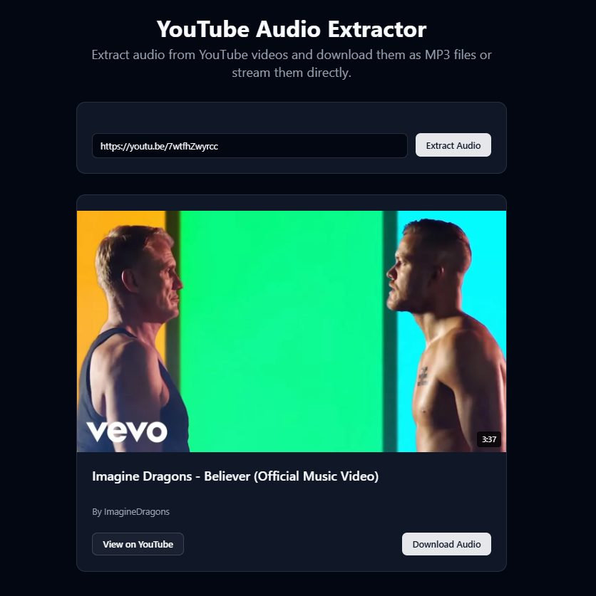

# YouTube Audio Extractor

A full-stack application that allows users to extract audio from YouTube videos and download them as MP3 files or stream them directly.

## Features

- **Simple Interface**: Clean, user-friendly design for easy audio extraction
- **MP3 Download**: Convert YouTube videos to MP3 files with a single click
- **Audio Streaming**: Stream audio directly when download isn't possible
- **Smart Fallback**: Automatically switches between download and streaming based on availability
- **Proxy Streaming**: Handles YouTube URL expiration issues with server-side proxying
- **Format Conversion**: Converts videos to high-quality MP3 when FFmpeg is available

## How It Works

1. **Enter YouTube URL**: Paste any valid YouTube video URL
2. **Preview Video**: View video information including title, author, and duration
3. **Extract Audio**: Download as MP3 or stream directly in the browser
4. **Enjoy**: Listen to the audio without the need for third-party apps

## Technology Stack

### Backend
- FastAPI (Python web framework)
- yt-dlp (YouTube download library)
- FFmpeg (Audio conversion tool)
- Vercel (Deployment platform)

### Frontend
- Next.js 14 (React framework)
- TypeScript (Type-safe JavaScript)
- Shadcn UI (Component library)
- TanStack Query (Data fetching)
- Sonner (Toast notifications)

## Architecture

The application is split into two main components:

### API Service
The backend handles YouTube URL validation, audio extraction, and format conversion. It provides multiple endpoints:
- `/api/youtube/info` - Retrieves video information
- `/api/youtube/extract-audio` - Downloads audio as MP3
- `/api/youtube/stream-url` - Gets a streamable URL
- `/api/youtube/proxy-audio` - Proxies audio stream to avoid CORS issues

### Web Interface
The frontend provides an intuitive interface for users to interact with the API. It handles:
- URL input and validation
- Video preview and information display
- Audio playback with custom controls
- Download and streaming capabilities

## Limitations

- YouTube's terms of service may restrict the use of this application for certain videos
- Audio quality depends on the original video source
- Very long videos may have limitations due to server constraints
- Stream URLs from YouTube expire quickly, requiring the proxy solution

## Legal Considerations

This application is intended for personal use only. Users are responsible for ensuring they have the right to download or stream content and should respect copyright laws and YouTube's terms of service.

## Credits

- [yt-dlp](https://github.com/yt-dlp/yt-dlp) - YouTube download library
- [FFmpeg](https://ffmpeg.org/) - Media conversion tool
- [Next.js](https://nextjs.org/) - React framework
- [FastAPI](https://fastapi.tiangolo.com/) - Python web framework
- [Shadcn UI](https://ui.shadcn.com/) - UI component library
